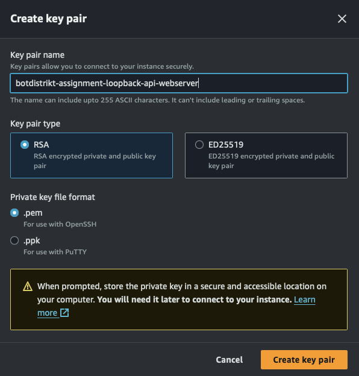
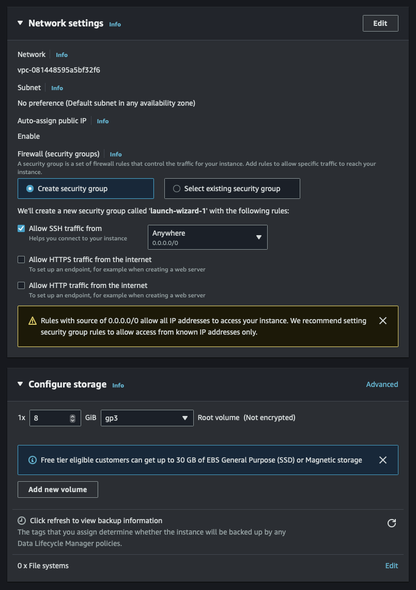
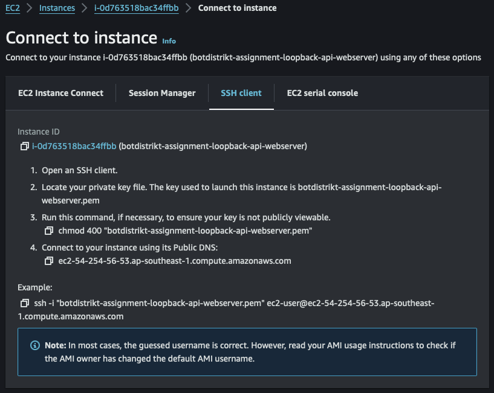
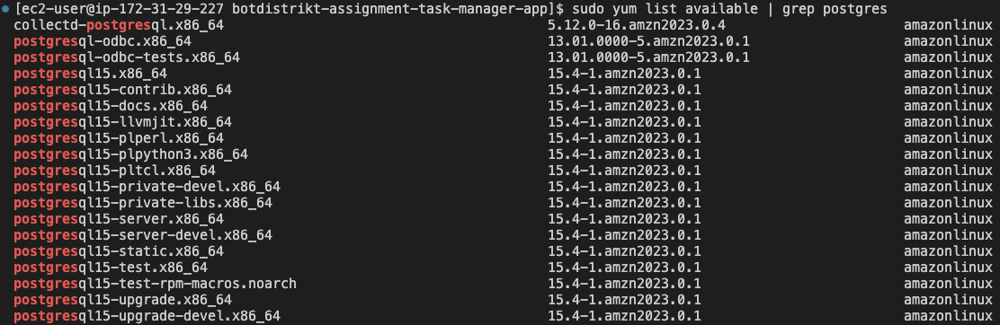

<!-- ## `Webserver` repository for botdistrikt interview assignment


#### Deployment stack
#### Backend
`Webserver`: AWS EC2
Database server: postgreSQL Amazon RDS
Environment management: AWS Secrets Manager


#### Setup of AWS EC2 Webserver
<br>

Launch EC2 instance with Amazon Linux OS

<br>

Name and download private key 'botdistrikt-assignment-loopback-api-webserver.pem' into /Users/your-username/.ssh

<br>


<br>


<br>


<br>
<br>

Set up EC2 instance on AWS
Connect to EC2 instance via `ssh -i botdistrikt-assignment-loopback-api-webserver.pem ec2-user@ec2-54-254-56-53.ap-southeast-1.compute.amazonaws.com` or set up a custom ssh config file with the ssh extention on vscode
<br>

Install git
`sudo yum install git -y`
<br>

Go to development environment
`cd /home/ec2-user/`
<br>

Clone botdistrikt-assignment-loopback-api-webserver from github into the EC2 webserver dev env
`git clone https://github.com/malepsyche/botdistrikt-assignment-loopback-api-webserver.git`
<br>
 -->


## Botdistrikt Interview Assignment
<br>


## Prerequisites
- AWS Account
<br>


## Tech Stack
- **Server**: AWS EC2
- **Frontend**: EmberJS
- **Backend API**: Loopback
- **Database**: PostgreSQL
- **Containerisation**: Docker
<br>


## Docker Containers
- **Encapsulate the app and database seperately**
- **Container 1: Frontend and Backend App**
- **Container 2: PostgreSQL Database**
<br>


## Setup of AWS EC2 server instance

#### 1. Launch EC2 instance with Amazon Linux OS  

<br>

#### 2. Create new key-pair

<br> 

#### 3. Name and download private key 'botdistrikt-assignment-loopback-api-webserver.pem' into `/Users/your-username/.ssh` 

<br> 

#### 4. 

<br> 

#### 5. 

<br> 

#### 6. Set up EC2 instance on AWS  
Connect to EC2 instance via 
```zsh 
ssh -i botdistrikt-assignment-loopback-api-webserver.pem ec2-user@ec2-54-254-56-53.ap-southeast-1.compute.amazonaws.com
``` 
or set up a custom ssh config file with the ssh extension on vscode.
<br> 

#### 7. Install git  
```zsh 
sudo yum install git -y
```
<br> 

#### 8. Go to development environment  
```zsh 
cd /home/ec2-user/
```
<br> 

#### 9. Clone botdistrikt-assignment-loopback-api-webserver from github into the EC2 webserver dev env  
```zsh 
git clone https://github.com/malepsyche/botdistrikt-assignment-loopback-api-webserver.git
```
<br> 


## Setup CloudWatch Agent (Optional)
- [Setup Amazon CloudWatch Agent](CLOUDWATCH_SETUP.md)
<br>


## NodeJS and Loopback Installation into server

#### 1. Install node version manager (nvm)
- **Version manager for nodejs**
- **Note: Package files are installed into server root directory ~/.nvm instead of the application directory**
- **[Full nvm documentation including installation](https://github.com/nvm-sh/nvm#installing-and-updating)**

```zsh
# Download nvm.sh script into ~/.nvm/nvm.sh
curl -o- https://raw.githubusercontent.com/nvm-sh/nvm/v0.39.7/install.sh | bash
# Execute nvm.sh script
. ~/.nvm/nvm.sh
# Install node v12
nvm install 12
# Install Loopback 3 CLI globally using npm
npm install -g loopback-cli
```
<br>


## Docker Installation
- **Install Docker**
```zsh
sudo yum install docker -y
```

- **Start Docker service**
```zsh
sudo systemctl start docker
```

- **Enable Docker to start on boot**
```zsh
sudo systemctl enable docker
```

- **Verify Docker Installation**
```zsh
docker --version
```
<br>


## Docker compose Installation
- **Download the Docker Compose binary**
```zsh
sudo curl -L "https://github.com/docker/compose/releases/latest/download/docker-compose-$(uname -s)-$(uname -m)" -o /usr/local/bin/docker-compose
```

- **Apply executable permissions to the binary:**
```zsh
sudo chmod +x /usr/local/bin/docker-compose
```

- **To verify that Docker Compose is installed correctly, run:**
```zsh
docker-compose --version
```
<br>


## Setup Environment Credentials for Dockerized PostgreSQL database image
- **Create empty .env file:**
```zsh
nano /home/ec2-user/botdistrikt-assignment-task-manager-app/.env
```
```zsh
# Replace these with your own preferred credentials if necessary
DB_USER=myuser
DB_PASS=mypassword
DB_NAME=mydatabase
```
<br>


## Frontend Setup with EmberJS
- **Navigate to application root directory**
```zsh
cd /home/ec2-user/botdistrikt-assignment-task-manager-app
```
- **Install Ember CLI into server**
```zsh
npm install -g ember-cli
```
- **Generate a new Ember application**
```zsh
ember new my-ember-app
```
- **Navigate into the new app directory**
```zsh
cd my-ember-app
```
- **Implement User Interfaces**
```zsh
ember generate component task-list
ember generate component author-list
```
- ****
```zsh
```
- ****
```zsh
```
- ****
```zsh
```
- ****
```zsh
```


## Build and run the docker containers
```zsh
sudo docker-compose up --build
```
<br>


<!-- ## PostgreSQL Database installation into server

#### Update Your Package Repository:
- **`sudo yum update -y`**

#### Find the available PostgreSQL packages
- **`sudo yum list available | grep postgres`**
- ****
<br>

#### Install the Identified PostgreSQL Package
- **Once you've identified the correct package name, you can install PostgreSQL like so (replace XX with the actual version number found):**
- **`sudo yum install -y postgresqlXX-server`**
- **We will be using v15:`sudo yum install -y postgresql15 postgresql15-server`**

#### Initialise Database:
sudo /usr/bin/postgresql-setup --initdb

#### Start and Enable the PostgreSQL Service
sudo systemctl start postgresql
sudo systemctl enable postgresql

#### Enter postgreSQL database account
sudo -u postgres -i

#### Access the postgreSQL prompt
psql

#### Set a password for the PostgreSQL user (replace newpassword with a strong password):
\password postgres


 -->
