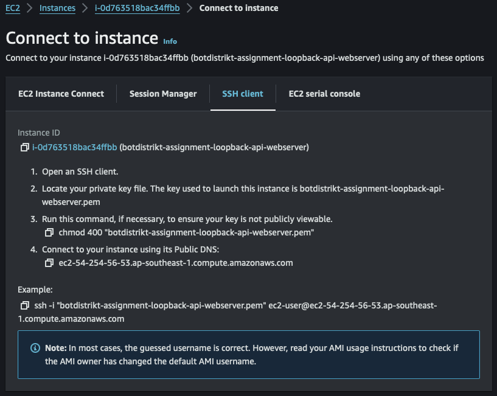
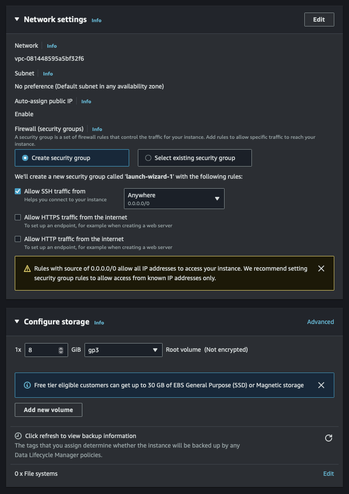
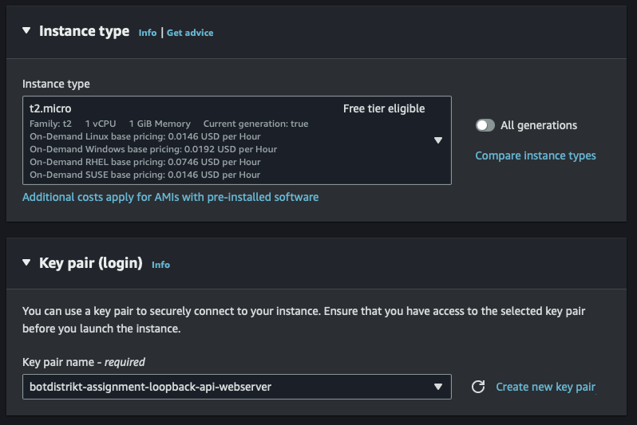
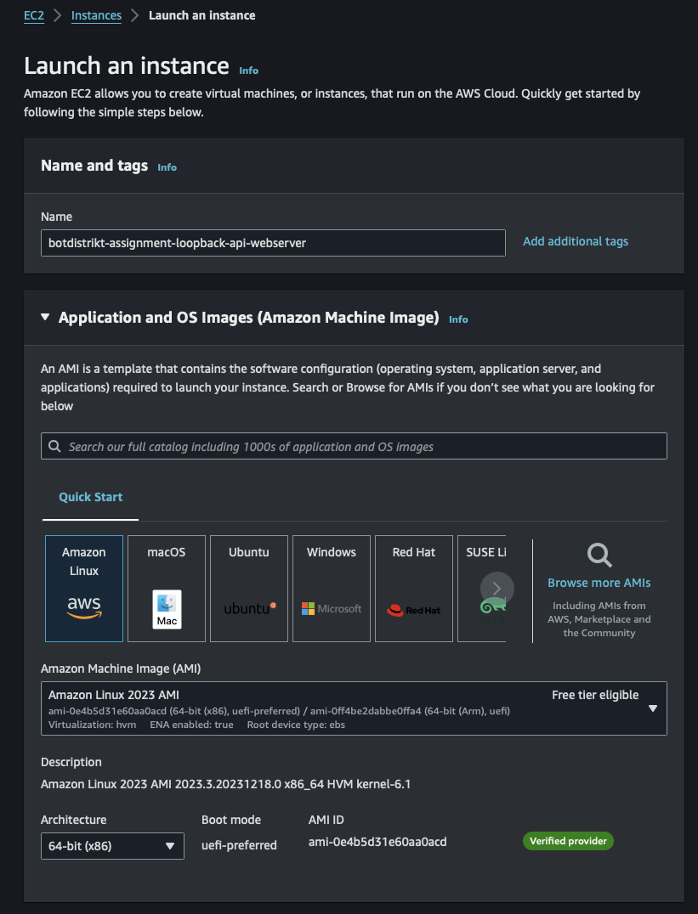

Loopback api webserver

This is the webserver repository for botdistrikt interview assignment: Loopback api

Deployment stack
Webserver: AWS EC2
database server: postgreSQL Amazon RDS
Environment management: AWS Secrets Manager

Setup of AWS EC2 Webserver

Set up EC2 instance on AWS
Name and download private key 'botdistrikt-assignment-loopback-api-webserver.pem' into /Users/your-username/.ssh
Connect to webserver via 
